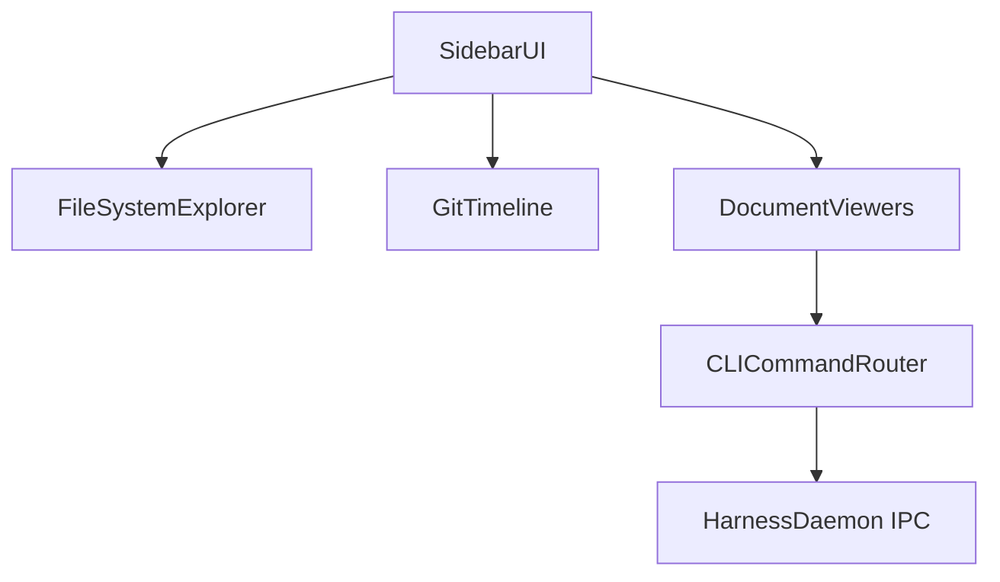

# Domain Decomposition: Harness IDE-like UI (File Tree, Git History & File Viewers)

## 1. Architecture Decision

**Chosen Architecture**: Monolith - Modular GUI desktop application modules in Swift.
**Communication Pattern**: In-memory NotificationBus, delegate patterns, and Swift async-await concurrency actors.
**Data Strategy**: Shared application state model (SessionCoordinator, SurfaceRegistry, and Workspace state) scoped by in-memory caching.

### Decision Analysis
**Complexity Factors Analyzed**:
- **Domain Complexity**: Medium domain complexity with distinct UI modules (Sidebar, Git, Files, WebViews) coordinating with the background PTY daemon.
- **Team Size**: Solo developer working pair-programmed.
- **Scalability Requirements**: UI frame rendering at 60+ FPS, async file scanning for large codebases (>10k files), background git log parsing.
- **Integration Needs**: Integrates with local file system APIs (FileManager), local git binary subprocess execution, and WebKit (WKWebView).
- **Operational Capability**: Client macOS AppKit app running locally.

**Decision Criteria Applied**:
- [x] High-performance rendering needs (Metal viewports + AppKit Outlines require synchronous layout loops).
- [x] In-memory shared state between PTY shell trackers and sidebar.
- [x] Native AppKit component access (NSViewController, NSTableViews).

**Rationale**: A modular monolith architecture inside the native Swift app project is chosen because Harness is a standalone macOS terminal desktop application. Modularity will be enforced through clear package partitions (e.g. adding modular files under `Packages/HarnessCore` and `Apps/Harness/Sources/HarnessApp/UI`).

---

## 2. Bounded Context Boundaries

### Sidebar Navigation & Layout Context (Module: SidebarUI)
**Domain Area**: macOS sidebar chrome, view toggles, and panel layouts.
**Responsibilities**:
- Render the unified tab control (Sessions, Files, Git).
- Manage the double-column sidebar resizing logic.
- Stack the accordion sub-panels (Open Editors, Project Files).
- Sync sidebar selections with the active tab/session model.

**User Stories Covered**:
- PBI-001: Sidebar Layout & Navigation

**Key Entities**:
- `HarnessSidebarPanelViewController` (Main sidebar coordinator)
- `SidebarTabSelector` (Segmented controller)
- `DoubleSidebarLayoutManager` (Custom split/resize logic)
- `AccordionPanelController` (Collapsible sections container)

**Module Implementation**: Extends `HarnessSidebarPanelViewController.swift` and adjacent classes in the `Sources/HarnessApp/UI` target.

---

### Workspace File System Explorer Context (Module: FileSystemExplorer)
**Domain Area**: Local directory scanning, file system watching, and file-tree data binding.
**Responsibilities**:
- Asynchronously scan the active workspace folder directory path.
- Watch for file additions, deletions, and updates using kernel file notifications.
- Expose a tree model data source (`NSOutlineViewDataSource`) for the outline view.
- Lazy-load directory branches to keep memory usage low.

**User Stories Covered**:
- PBI-001: Sidebar Layout & Navigation

**Key Entities**:
- `FileNode` (File/directory object representation)
- `FileTreeWatcher` (Asynchronous directory monitor)
- `FileTreeOutlineViewDataSource` (Outline view binder)

**Module Implementation**: Added as a sub-module under `Packages/HarnessCore` (data models) and linked to `HarnessSidebarPanelViewController` (UI rendering).

---

### Context-Aware Document Viewer Context (Module: DocumentViewers)
**Domain Area**: Markdown formatting previews, YAML validation panels, and WebView integrations.
**Responsibilities**:
- Render `.md` files natively using styled text containers.
- Render `.yaml` configurations and show visual diagrams/validation inside a web editor.
- Cache and reuse WebKit view instances to minimize memory load.

**User Stories Covered**:
- PBI-002: Context-Aware File Click Router & Viewports

**Key Entities**:
- `FileClickRouter` (Decision engine mapping file extensions to views)
- `MarkdownPreviewViewController` (AppKit native text view)
- `MonacoEditorWebViewController` (WKWebView wrapper for Monaco)

**Module Implementation**: Placed in `Apps/Harness/Sources/HarnessApp/UI` as new view controllers.

---

### Git Operations & Timeline Context (Module: GitTimeline)
**Domain Area**: Git subprocess tracking, commit parsing, and custom branch timeline rendering.
**Responsibilities**:
- Parse git log outputs (`git log --graph --oneline`) asynchronously using `Process` (NSTask).
- Draw graphical branch/merge lines and commit nodes in the sidebar list.
- Expose modified files (Git Status) for the active branch.

**User Stories Covered**:
- PBI-003: Native Git Tree & Commit History Timeline

**Key Entities**:
- `GitCommitNode` (Commit entity with author, date, hash, and parent IDs)
- `GitLogParser` (Subprocess wrapper)
- `GitTimelineOutlineView` (Custom AppKit cell renderer for tree graphs)

**Module Implementation**: Subprocess modules under `Packages/HarnessCore/Sources/HarnessCore` and rendering cells in `Apps/Harness/Sources/HarnessApp/UI`.

---

### PTY Command Router Context (Module: CLICommandRouter)
**Domain Area**: Bridge translating GUI clicks to terminal multiplexer commands.
**Responsibilities**:
- Execute shell actions in active panes (e.g. typing TUI edit commands).
- Split panes programmatically when a code file is clicked.

**User Stories Covered**:
- PBI-002: Context-Aware File Click Router & Viewports

**Key Entities**:
- `CLICommandRouter` (Translates router actions to `harness-cli` actions or IPC message requests).

**Module Implementation**: Integrates with `SessionCoordinator` and `MainExecutor`.

---

## 3. Data Ownership

| Bounded Context | Owned Data | Read Access | Write Access |
|-----------------|------------|-------------|--------------|
| **SidebarUI** | Sidebar Tab index, Expand state | All modules | SidebarUI |
| **FileSystemExplorer** | FileTree Cache, Watcher state | SidebarUI, Viewers | FileSystemExplorer |
| **DocumentViewers** | Open editor cache | SidebarUI | DocumentViewers |
| **GitTimeline** | Parsed commits, Git Status map | SidebarUI | GitTimeline |
| **CLICommandRouter** | Active Pane Surface Keys | All modules | CLICommandRouter |

---

## 4. Business Rules

- **Asynchronous File Scan**: File scanning must run on a background queue (`Task.detached` or specific FileActor) and notify the main thread only on batch completions to avoid freezing the AppKit UI.
- **PTY IPC Priority**: Keystroke PTY write messages always take priority over directory scanning or Git logging tasks in the Daemon queues.

---

## 5. Integration Patterns

### Key Process Flows

#### Open Code File (TUI Split Editor)
```
1. SidebarUI (Click FileNode) → FileClickRouter (Mime-check: Code) → CLICommandRouter
2. CLICommandRouter → Send IPC `split-window` & `send-keys` → HarnessDaemon (PTY)
```

#### Open Markdown File (Native Preview)
```
1. SidebarUI (Click FileNode) → FileClickRouter (Mime-check: Markdown) → DocumentViewers
2. DocumentViewers → Open MarkdownPreviewViewController → Show formatted text inside Split Layout
```

#### Open YAML File (Monaco Web Preview)
```
1. SidebarUI (Click FileNode) → FileClickRouter (Mime-check: YAML) → DocumentViewers
2. DocumentViewers → Open MonacoEditorWebViewController (Loads WKWebView) → Show Monaco editor
```

---

## 6. Context Map

### Dependencies Diagram



### Relationship Types
- **SidebarUI → FileSystemExplorer**: Queries folder nodes to render the outline list.
- **SidebarUI → GitTimeline**: Triggers git branch parsing and displays the commit history tree.
- **SidebarUI → DocumentViewers**: Routes clicked files to the preview screens.
- **DocumentViewers → CLICommandRouter**: Instructs terminal panes to execute editor splits for code editing.

---

## 7. Implementation Strategy

### Phase 1: Core Bounded Contexts
1. **FileSystemExplorer & FileTree UI**: Implementing outline tree data source and directory scanners.
2. **SidebarUI Tabs**: Adding Segmented Control selector and panel switching.

### Phase 2: Supporting Bounded Contexts
3. **FileClickRouter & DocumentViewers**: Markdown viewer and Monaco Webview editor.
4. **GitTimeline**: Parse git branch logs and draw commit graphs.

---

## 8. Success Criteria
- [x] Monolith architecture and package split defined.
- [x] Bounded contexts (SidebarUI, FileSystemExplorer, DocumentViewers, GitTimeline, CLICommandRouter) mapped.
- [x] Context diagram showing dependencies.
- [x] Integration patterns and business rules mapped out.
