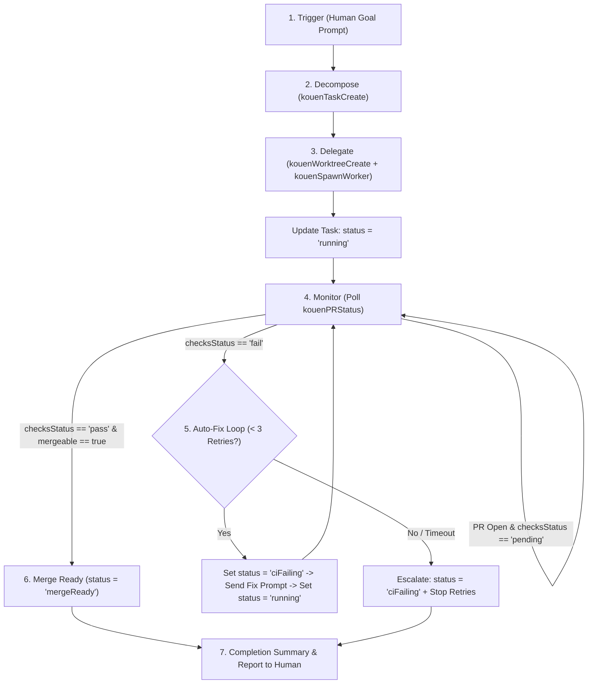
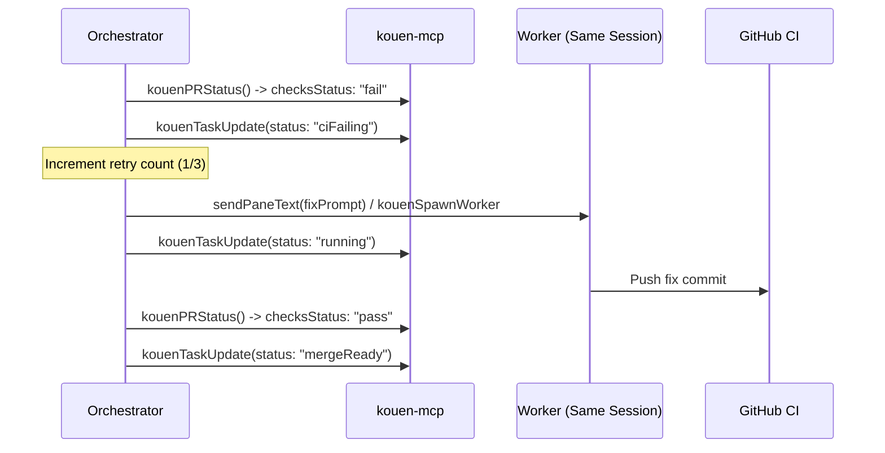

# Kouen Orchestrator Session Contract

> **Contract Version**: 1.0 (P44c + P44d)  
> **Status**: Active  
> **Applicability**: Human-initiated CLI agent sessions (Claude Code, OpenAI Codex, Gemini CLI, Kiro) acting as Orchestrators via `kouen-mcp`.

---

## 1. Overview & Architecture Principle

This document defines the exact procedural contract an external CLI coding agent follows when acting as an **Orchestrator** in Kouen.

### Core Architecture Principles

1. **CLI Agents + MCP Surface (No Owned AI Runtime)**  
   Kouen is a native macOS terminal multiplexer and MCP server (`kouen-mcp`). It provides a rich control surface for sessions, panes, git worktrees, and tasks. Kouen **does not** host an internal LLM runtime or first-party planning engine. The wrapped CLI agent provides all planning, decomposition, reasoning, and code generation intelligence.
2. **Interactive Goal Execution (No Scheduled / Unattended Triggers)**  
   An Orchestrator runs exclusively within a human-initiated interactive conversation turn. Scheduled or cron-like agent execution is owned separately by **P41 Automations** (`kouenAutomation*`).
3. **Strict Worktree Isolation**  
   Every Worker delegated by an Orchestrator operates inside an isolated git worktree (`kouenWorktree*`) created under `<repoRoot>/.kouen-worktrees/<name>`.
4. **Human-Gated Merge (Zero Auto-Merge)**  
   An Orchestrator **never** merges code into the base branch, even when CI checks are 100% green. Merging is strictly reserved for the human developer via Kouen's **M8 Merge Waiver / PR Merge Action**.

---

## 2. Roles & Vocabulary

| Term | Role in Orchestration |
|---|---|
| **Orchestrator (session)** | The root CLI agent session interacting directly with the human developer. Given a goal, it decomposes work into Tasks, delegates to Worker sessions, monitors progress via MCP, drives the Auto-Fix Loop, and reports status. |
| **Worker (session)** | An independent CLI agent session spawned by the Orchestrator via `kouenSpawnWorker` to complete a single Task inside an isolated git worktree. |
| **Task** | A persistent checklist item created on the Orchestrator's session via `kouenTaskCreate`. Status transitions (`open` → `running` → `ciFailing` / `mergeReady` → `done`) reflect live on Kouen UI surfaces (tab pills, sidebar, `GitPanelView`). |
| **Worktree** | An isolated git worktree managed via `kouenWorktreeCreate` / `kouenWorktreeRemove`. Maps 1:1 to a Worker branch. |
| **Auto-Fix Loop** | A bounded retry cycle (max 3 retries, 15m timeout) triggered when a Worker's PR fails CI checks. Reuses the same Worker session and worktree. |
| **M8 Merge Waiver** | Kouen's human-gated PR merge mechanism (`SidebarSessionListView.mergePR` and `GitPanelView.mergeWorktreeAction`). Requires human confirmation and strategy selection (squash/rebase/merge). |

---

## 3. Step-by-Step Orchestration Lifecycle



---

### Step 1: Trigger & Initialization

- **Trigger**: The human developer prompts the Orchestrator in a normal interactive CLI session with a high-level goal (e.g., *"Implement feature X and update documentation"*).
- **Session Identification (best-effort, not guaranteed unique)**: `kouenList()` has no "which entry is me" field — it lists every workspace/session/tab, and Kouen's own internal context resolver (`WorkbenchContextResolver`) falls back to whichever tab is currently **UI-focused**, which is not necessarily the tab the Orchestrator is actually running in (the human may have clicked to a different tab). The practical approach: call `kouenList()`, match a tab whose `cwd` equals the Orchestrator's own known working directory (e.g. the shell's `pwd`), and use that tab's owning session as `sessionId`. If more than one open tab shares that `cwd`, this is ambiguous — fall back to the UI-focused session (`kouenList`'s active-session marker) and note the ambiguity in your first response to the human rather than silently guessing wrong. This only matters for *where Orchestrator-owned Tasks get created* (Step 2) — it does not block delegation, since Worker sessions are identified by the `sessionId`/`surfaceId` `kouenSpawnWorker` itself returns, not by this resolution.
- **Scope Boundary**: The Orchestrator operates synchronously within this human conversation turn. It does not configure background cron or register headless tasks.

---

### Step 2: Decompose Goal into Tasks

The Orchestrator analyzes the repository structure and splits the goal into discrete, verifiable units of work.

1. For each unit of work, create a Task scoped to the Orchestrator's session:
   ```json
   // kouenTaskCreate
   {
     "sessionId": "<orchestrator-session-uuid>",
     "title": "Implement auth token refresh logic"
   }
   ```
2. **Session Scoping Rule**: Tasks belong to exactly one session (the Orchestrator's session). Do not attempt to attach Orchestrator tasks to Worker session IDs.
3. Newly created tasks initialize with `status: "open"`.

---

### Step 3: Delegate to Worker Sessions

For each open Task:

#### 1. Create an Isolated Git Worktree
Isolate the Worker's changes from the main checkout and other parallel workers:
```json
// kouenWorktreeCreate
{
  "repoPath": "/Users/user/Git/Personal/project",
  "sessionId": "auth-token-refresh",
  "branch": "feature/auth-token-refresh",
  "baseRef": "origin/main"
}
```
*Worktree Convention*:
- Worktrees are created under `<repoRoot>/.kouen-worktrees/<sessionId>`.
- **Never** nest a worktree inside an existing worktree directory. Always create from the primary repository root.

#### 2. Spawn Worker with Atomic Prompt Delivery
Spawn the Worker session, bind it to the worktree, and deliver the execution prompt:
```json
// kouenSpawnWorker
{
  "agent": "claude",
  "cwd": "/Users/user/Git/Personal/project/.kouen-worktrees/auth-token-refresh",
  "worktreePath": "/Users/user/Git/Personal/project/.kouen-worktrees/auth-token-refresh",
  "parentRepoPath": "/Users/user/Git/Personal/project",
  "taskName": "Implement auth token refresh logic",
  "prompt": "You are working on Task: Implement auth token refresh logic.\n\nContext & Requirements:\n- Target files: Sources/Auth/TokenManager.swift\n- Implement proactive token expiration checks and refresh retry logic.\n- Verify all unit tests pass with `swift test --filter AuthTests`.\n\nDeliverable:\n- Commit your changes with a clear message.\n- Push branch 'feature/auth-token-refresh' to origin.\n- Open a PR against main using `gh pr create --title \"Implement auth token refresh\" --body \"...\"`."
}
```

*Safety Invariant*:
- Supported agents: `"claude"`, `"codex"`, `"gemini"`, `"kiro"`.
- `agent: "cursor"` is **strictly rejected** by `kouenSpawnWorker` (Cursor launches a GUI editor and exits to the shell prompt immediately, which would cause the prompt text to execute as raw shell commands).

#### 3. Update Task Status to Running
Immediately mark the Task as active:
```json
// kouenTaskUpdate
{
  "id": "<task-uuid>",
  "status": "running"
}
```
*UI Reflection*: The session tab pill and sidebar row display a blue/running badge (`BoardColumnKind.running`).

---

### Step 4: Monitor Worker & PR/CI Status

The Orchestrator monitors the Worker's progress toward PR creation and CI completion.

1. **Polling Mechanism**:
   Periodically poll PR and CI check status using `kouenPRStatus`:
   ```json
   // kouenPRStatus
   {
     "path": "/Users/user/Git/Personal/project/.kouen-worktrees/auth-token-refresh"
   }
   ```
   *Cadence*: Query every **30 to 60 seconds**.

2. **Auxiliary Output Inspection**:
   Before a PR is opened, the Orchestrator may inspect the Worker pane's activity via `readPaneOutput(surfaceId, lines: 50)` or `waitForPaneOutput(surfaceId, pattern)` if needed to check for crashes or interactive prompts.

3. **Evaluate `kouenPRStatus` Response**:
   - **No PR found / Worker active**: Continue polling until timeout.
   - `checksStatus == "pending"`: CI is executing on GitHub Actions / CI runner. Continue polling.
   - `checksStatus == "pass"` and `mergeable == true`: All checks succeeded cleanly. Transition to **Step 6 (Merge Ready)**.
   - `checksStatus == "fail"`: One or more CI checks failed. Transition to **Step 5 (Auto-Fix Loop)**.

---

### Step 5: Auto-Fix Loop (Safety Bounds & Escalation)

When a Worker's PR reports `checksStatus: "fail"`, the Orchestrator initiates the Auto-Fix Loop.



#### 1. Transition Status
Set the Task status to `ciFailing`:
```json
// kouenTaskUpdate
{
  "id": "<task-uuid>",
  "status": "ciFailing"
}
```
*UI Reflection*: Tab pill, sidebar, and `GitPanelView` worktree rows immediately display a red/error badge (`BoardColumnKind.error`).

#### 2. Reuse Existing Worker Session & Worktree
- **Strict Rule**: **NEVER** spawn a new/secondary Worker or create a separate worktree for the same Task.
- Reusing the existing Worker session and worktree checkout preserves git history, build artifacts, and modified state while preventing disk and worktree sprawl.

#### 3. Dispatch Fix Prompt
- If the Worker session is still active:
  ```json
  // sendPaneText
  {
    "surfaceId": "<worker-surface-uuid>",
    "text": "CI checks failed on your PR. Run `gh pr checks` to inspect the failing test logs, reproduce the failure locally in this worktree, apply the fix, verify all tests pass, and push a new commit to update the PR.\n"
  }
  ```
- If the Worker session exited:
  Call `kouenSpawnWorker` targeting the **exact same** `worktreePath` and `cwd`.
- Update Task status back to `running` while the fix is underway:
  ```json
  // kouenTaskUpdate
  {
    "id": "<task-uuid>",
    "status": "running"
  }
  ```

#### 4. Safety Bounds: Retry Ceiling & Timeouts

| Parameter | Bound | Rationale |
|---|---|---|
| **Max Retries** | **3 fix attempts** (4 CI runs total: 1 initial + 3 fixes) | An agent failing CI 3 consecutive times with targeted error logs is usually facing an architectural flaw, contradictory requirements, missing secrets, or flaky dependencies. Further automated loops burn excessive tokens and risk circular diff thrashing. |
| **Per-Attempt Timeout** | **15 minutes** per CI / fix cycle | Typical native and web test suites run in 2–8 minutes. 15 minutes provides ample buffer for CI queueing and compilation while preventing hung background workers from stalling the Orchestrator indefinitely. |
| **Initial Grace Timeout** | **5 minutes** | Maximum time allowed for a Worker to start up and begin executing before first output check. |

#### 5. Escalation on Repeated Failure
If the retry ceiling (3 retries) or timeout is reached without green checks:
1. Set the Task status permanently to `ciFailing`:
   ```json
   // kouenTaskUpdate
   {
     "id": "<task-uuid>",
     "status": "ciFailing"
   }
   ```
2. **Halt Retries**: Stop attempting automated fixes on this Task.
3. **Inline UI Escalation**: The red `ciFailing` badge remains visible at the tab, sidebar, and git panel worktree row, providing ambient awareness to the human developer.
4. **Conversational Escalation**: In the Orchestrator's CLI conversation response, explicitly report:
   - Which Task failed.
   - The total number of retries attempted.
   - The failing CI checks summary.
   - The PR URL and worktree path for manual human inspection.

---

### Step 6: Merge Readiness (The Absolute Non-Negotiable Rule)

> [!IMPORTANT]
> **Zero Auto-Merge Invariant**: The Orchestrator **NEVER** merges a Pull Request under any circumstance, even if `checksStatus == "pass"` and `mergeable == true`.

All merges in Kouen require human review and confirmation through Kouen's **M8 Merge Waiver / PR Merge Action**:
- **Sidebar Session Context Menu**: `SidebarSessionListView.mergePR` (gated by `canOfferMerge`: requires `mergeable == true` and either `checksStatus == .pass` or maintainer waiver `reviewDecision == "APPROVED"`). Presents a modal dialog for the human to pick the merge method (`squash`, `rebase`, or `merge commit`).
- **Git Panel Worktree Row**: `GitPanelView.mergeWorktreeAction` / `performMerge` (validates stack test steps, then prompts human confirmation).
- **Manual CLI**: Developer runs `gh pr merge <number> --squash`.

#### Setting `mergeReady` Status
When `kouenPRStatus` returns `checksStatus: "pass"` and `mergeable: true`:
1. Set the Task status to `mergeReady`:
   ```json
   // kouenTaskUpdate
   {
     "id": "<task-uuid>",
     "status": "mergeReady"
   }
   ```
2. *UI Reflection*: The badge displays in the "Needs Attention" color (amber/accent per `BoardColumnKind.needsAttention`) — a deliberate signal meaning *"Ready for human developer review and merge"*.
3. **Stop**: The Orchestrator takes no further automated action on this Task.

---

### Step 7: Completion & Human Summary

Once every Task reaches a terminal state (`mergeReady`, `done`, or `ciFailing`):

1. **Output Final Summary Report**:
   The Orchestrator prints a clear markdown table in its CLI turn:

   ```markdown
   ## Orchestration Summary

   | Task | Status | Worktree | PR / Branch | Action Required |
   |---|---|---|---|---|
   | Auth token refresh | `mergeReady` | `.kouen-worktrees/auth-token` | PR #142 (Pass) | Ready for human merge |
   | User profile cache | `ciFailing` | `.kouen-worktrees/user-cache` | PR #143 (Fail) | Escalated after 3 retries (TestTimeout) |
   | Update README docs | `done` | `.kouen-worktrees/docs-update` | PR #144 (Merged) | Completed |
   ```

2. **Provide Actionable Next Steps**:
   - Provide direct links to PRs ready for review and merge.
   - Provide troubleshooting pointers for any `ciFailing` tasks.
   - Remind the human to clean up worktrees post-merge via `kouenWorktreeRemove(repoPath, worktreePath)`.
3. **End Turn**: The Orchestrator concludes its turn.

---

## 4. Non-Goals & Anti-Patterns

| Anti-Pattern | Reason / Contract Rule |
|---|---|
| **Auto-Merge on Green** | Explicitly rejected. Merging changes code in base branches and must remain gated behind human developer confirmation (M8). |
| **Kouen-Owned AI Logic** | Kouen does not host an internal LLM. The Orchestrator is an ordinary CLI agent session using `kouen-mcp` tools. |
| **Unattended Cron Triggers** | Orchestration is strictly human-goal-initiated. Scheduled background agent execution belongs to P41 Automations (`kouenAutomation*`). |
| **Multi-Worker Single Worktree** | Never attach multiple Worker sessions to the same worktree. Each Worker must have an isolated git worktree created via `kouenWorktreeCreate`. |
| **Spawning New Worker on CI Retry** | Never spawn a second Worker or create a new worktree when retrying a CI failure. Always re-prompt the existing Worker session on its existing worktree. |
| **Using `cursor` as Worker** | Never pass `agent: "cursor"` to `kouenSpawnWorker`. Cursor is a GUI editor, not an interactive CLI agent; prompts cannot be piped into it safely. |

---

## 5. Tool Reference Cheat Sheet

| Tool | Purpose in Orchestration |
|---|---|
| `kouenList` | Discover Orchestrator session ID, open tabs, and worktree attachments. |
| `kouenTaskCreate` | Create a new Task scoped to the Orchestrator's session. |
| `kouenTaskUpdate` | Transition Task status (`open` → `running` → `ciFailing` / `mergeReady` → `done`). |
| `kouenTaskList` | Query Tasks belonging to the Orchestrator session. |
| `kouenWorktreeCreate` | Create an isolated git worktree under `.kouen-worktrees/` for a Worker. |
| `kouenWorktreeRemove` | Clean up a worktree after its PR is merged. |
| `kouenSpawnWorker` | Atomically spawn a Worker session and deliver its prompt. |
| `kouenPRStatus` | Check PR number, checks rollup status (`pass`/`fail`/`pending`), and `mergeable` state. |
| `sendPaneText` | Send follow-up fix prompts to an active Worker session during the Auto-Fix Loop. |
| `readPaneOutput` | Read recent console output from a Worker pane for auxiliary progress checks. |
